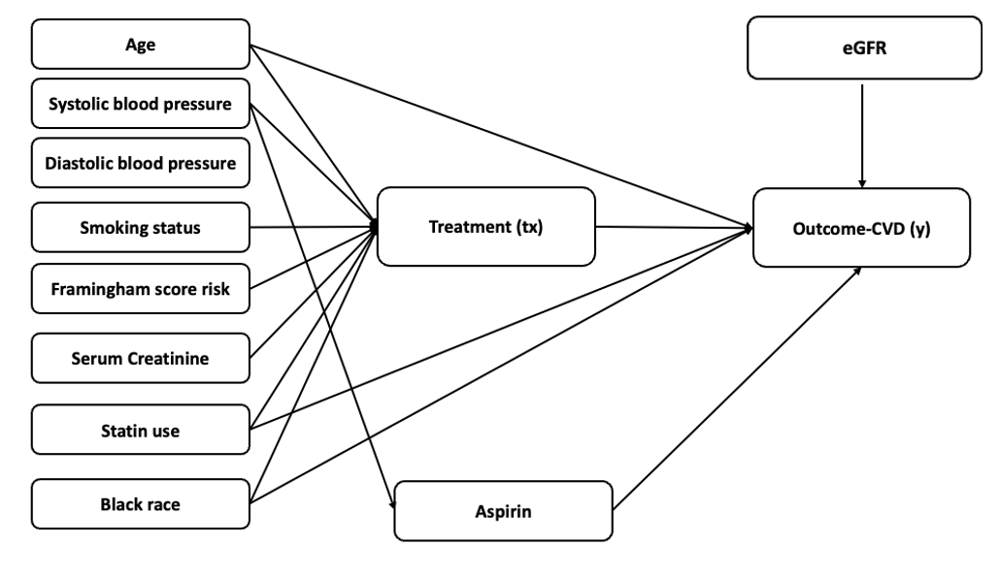

# Gcomputation_CausalForest_Compare
A comparative study of G-computation and Causal Forest for heterogeneous treatment effect estimation in simulated data.
# G-computation vs Causal Forest for Heterogeneous Treatment Effect Estimation

This repository contains code, figures, and supporting materials for a methodological comparison of **G-computation** and **Causal Forest** in estimating **heterogeneous treatment effects (HTEs)**. The project includes both **simulation studies** and a **real-data application** using the **Look AHEAD clinical trial**.

## Project description

Understanding whether treatment effects vary across patients is a central question in precision medicine and clinical decision-making. Rather than focusing only on the average treatment effect, this project investigates whether some patient subgroups may benefit more or less from treatment, and whether such heterogeneity can be identified reliably using different analytic approaches.

In this project, we compare two commonly used approaches for HTE estimation:

- **Parametric G-computation**, which estimates treatment effects through explicitly specified outcome models and treatment-covariate interaction terms
- **Causal Forest**, a machine learning approach designed to flexibly capture complex and potentially nonlinear treatment effect heterogeneity

The project evaluates these approaches in both controlled and realistic settings:

- **Simulation study**, where the true heterogeneous treatment effect structure is known
- **Real-data application**, using the **Look AHEAD clinical trial** to examine clinically meaningful subgroup effects on cardiovascular outcomes

The broader goal is to assess the trade-offs between **flexibility**, **interpretability**, and **causal validity** when estimating heterogeneous treatment effects.

## Study aims

The main objectives of this project are:

1. Compare the performance of G-computation and Causal Forest in detecting heterogeneous treatment effects
2. Evaluate whether the two approaches identify similar effect modifiers and subgroup structures
3. Assess the ability of each method to recover known treatment effect heterogeneity in simulation
4. Apply both methods to the Look AHEAD trial and examine clinically interpretable subgroup findings
5. Explore the balance between predictive flexibility and interpretability in HTE analysis

## Conceptual framework

The following directed acyclic graph (DAG) illustrates the assumed relationships among baseline covariates, treatment assignment, outcome, and key effect modifiers used in this project.



**Figure 1.** Conceptual framework for heterogeneous treatment effect analysis. Baseline covariates such as age, blood pressure, smoking status, Framingham risk score, serum creatinine, statin use, and Black race may influence treatment assignment and cardiovascular outcome. Estimated glomerular filtration rate (eGFR) and aspirin use are modeled as key effect modifiers through treatment interaction terms.

## Data sources

This project includes two major components:

### 1. Simulation study
The simulation component is used to evaluate methodological performance under known data-generating mechanisms. Because the true treatment effect structure is prespecified, simulation allows direct assessment of:

- recovery of heterogeneous treatment effect patterns
- identification of important effect modifiers
- subgroup detection performance
- robustness under different modeling assumptions

### 2. Look AHEAD trial application
The real-data component applies the methods to the **Look AHEAD (Action for Health in Diabetes)** clinical trial. The purpose is to examine whether both methods identify clinically meaningful heterogeneity in treatment effects on cardiovascular outcomes.

## Methods included

The repository includes code for:

- data preprocessing and variable preparation
- simulation of heterogeneous treatment effects
- parametric G-computation
- Causal Forest modeling
- interaction screening and variable selection
- subgroup identification
- individual treatment effect estimation
- visualization of variable importance and subgroup patterns

## Why `glinternet` is included in this project

In addition to G-computation and Causal Forest, this project uses **`glinternet`** as a tool for identifying important **main effects** and **hierarchical treatment-related interactions**.

One major advantage of `glinternet` is that it respects the **strong hierarchy principle**, meaning that interaction terms are selected in a structured and interpretable manner. This makes it useful when the goal is to screen for potential treatment-effect modifiers before fitting a final interpretable model.

## Use of `glinternet` in RCT and observational settings

### Why `glinternet` can be used more directly in an RCT

In a **randomized controlled trial (RCT)**, treatment assignment is randomized by design. Because of this, treatment is not systematically confounded by baseline covariates, and no additional propensity-score weighting step is required for confounding adjustment.

In this setting, `glinternet` can be used more directly as an interaction-discovery tool to identify candidate main effects and treatment-by-covariate interactions that may reflect heterogeneous treatment effects.

### Why observational studies require an additional step

In an **observational study**, treatment assignment is not randomized. Therefore, confounding must be addressed using methods such as **inverse probability of treatment weighting (IPTW)** or other adjustment strategies.

The challenge is that `glinternet` does **not natively accommodate continuous observation weights** in the same way as a standard weighted generalized linear model, especially within its penalized fitting and cross-validation procedure. As a result, it is not straightforward to use `glinternet` directly as the final confounding-adjusted estimation model in observational data.

### Two-stage post-selection strategy

To address this limitation, we adopted a **two-stage post-selection strategy**:

1. Run `glinternet` on the raw, unweighted data to identify important main effects and hierarchical interaction terms
2. Extract the selected variables and interactions from the fitted `glinternet` model
3. Translate the selected terms into a conventional regression formula
4. Refit the selected structure using a standard weighted logistic regression model (`glm`) with stabilized IPTW

In this framework:

- `glinternet` is used for **structure learning** and **interaction discovery**
- weighted `glm` is used for **confounding-adjusted effect estimation**

This allows us to preserve the interaction-screening advantage of `glinternet` while performing final estimation in a model that properly accommodates continuous weights.

### Practical interpretation

In short:

- In an **RCT**, `glinternet` can be used more directly because randomization already supports exchangeability
- In an **observational study**, `glinternet` needs an additional post-selection step because confounding adjustment must be incorporated outside its native fitting framework

## Analytical workflow

A simplified workflow for this project is:

1. Prepare analytic data and baseline covariates
2. Fit interaction-screening models when needed
3. Estimate treatment effects using G-computation
4. Estimate treatment effects using Causal Forest
5. Compare variable importance, subgroup structure, and estimated treatment effect patterns
6. Summarize similarities and differences in interpretability and performance

## Repository structure

```text
├── script/               # R scripts for simulation, modeling, and plotting
├── figure/               # figures used in README 
└── README.md
